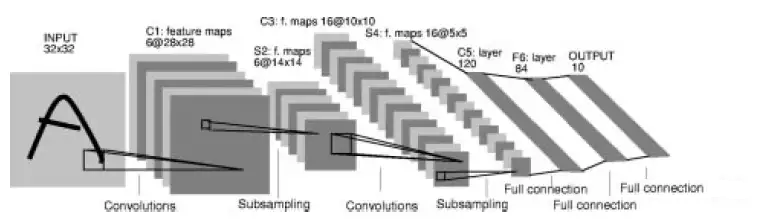
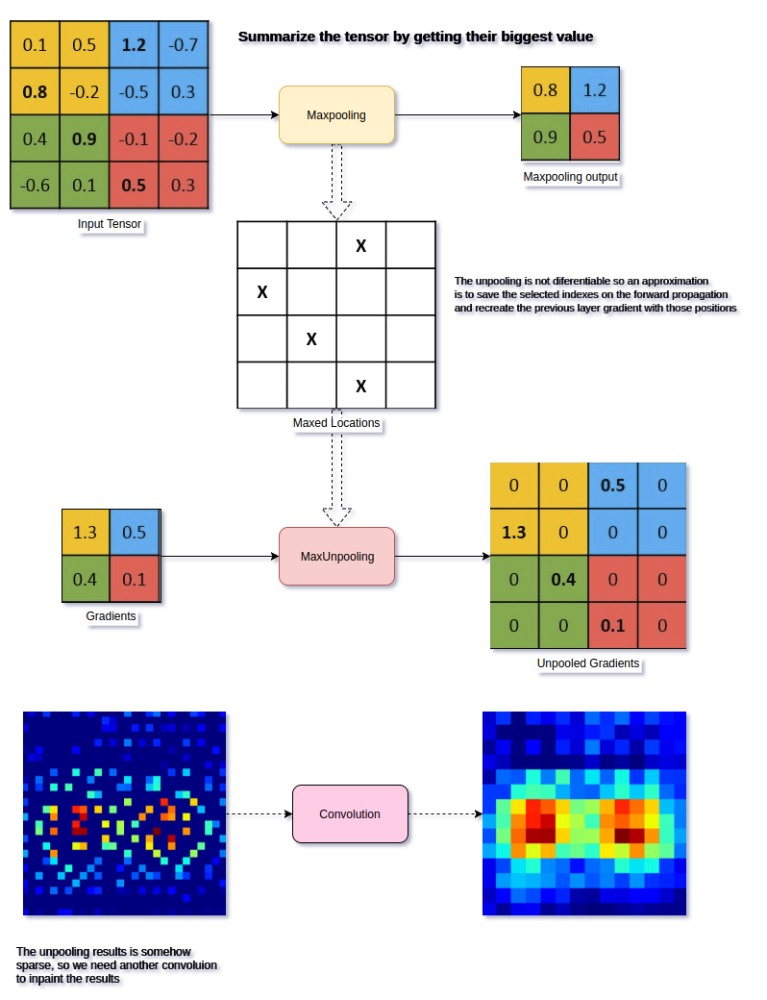
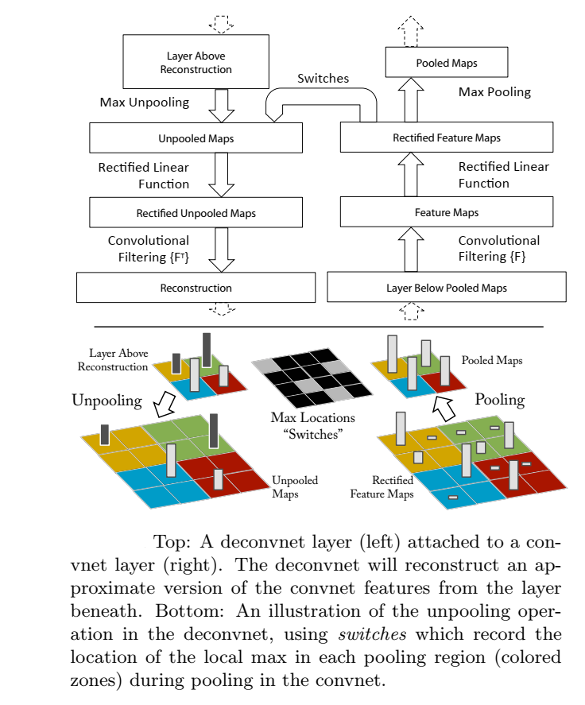

# CNN-activation-visualization
A code to visualize the various layer activations of a CNN

**Visualizing intermediate layers of a neural network:** This project
shows what kind of patterns in an image a convolutional neural network
(CNN) learns to recognize. This work is based on "Visualizing and
Understanding Convolutional Networks"[@Deconv].

[**TASK 1**)]{.underline} Build and train a CNN to classify MNIST
digits. The CNN architecture to be implemented should have layers in
below order and specifications:

-   28×28 input image.

-   6 (5×5 size) convolutional filters with stride 1x1 and 2x2 padding.

-   ReLU activation.

-   Max Pooling layer (2×2 size and 2x2 stride).

-   16 (5×5 size) convolutional filters with stride 1x1 and no padding.

-   ReLU activation.

-   Max Pooling layer (2×2 size and 2x2 stride).

-   Flatten

-   Fully connected linear layer with 16x5x5 = 400 inputs and 120
    outputs.

-   ReLU activation.

-   Fully connected linear layer with 120 inputs and 84 outputs.

-   ReLU activation.

-   Fully connected linear layer with 84 inputs and 10 outputs.

-   A log softmax layer to output class probabilities.

[**NOTE-1**]{.underline}-The model code provides access to the
convolutional filters and outputs from maxpooling layers through the
functions outside the CNN model even after the training is complete. In
Pytorch (assuming you are defining your model as a class) this may mean
defining/referencing the layers with 'self.' prefix. In Tensorflow, it
may mean explicitly naming the layer as a named node.
[**NOTE-2**]{.underline}- In the max-pooling step, location of the
maxima within a pooling region is also accessible to functions outside
the CNN model. These modifications will be required for the
visualization task.

This is the classic LeNet-5  [@LENET5] model (with some modifications).
Graphically, the model architecture would look as shown in
Fig.-[1](#fig:LeNet5){reference-type="ref" reference="fig:LeNet5"}:

{#fig:LeNet5}

You can calculate the size of output after convolution operation, using
the formula: $$O = \dfrac{I+2P-K}{S} + 1$$ where, $O$ is the output
width/height, $I$ is the input width/height, $P$ is the
width/height-wise padding size, $K$ is the width/height of the
convolotional filter, $S$ is the width/height-wise stride size.

After training this model, we will visualize the intermediate layer
activations look. For this we can follow the approach shown in
 [@Deconv], **where they map the layer activations back to input pixel
space, showing what input pattern actually caused a given activation to
light up!**

\"To examine a convnet, a deconvnet is attached to each of its layers,
as illustrated in Fig. [3](#fig:deconv){reference-type="ref"
reference="fig:deconv"}(top). To start, an input image is presented to
the convnet and features are computed throughout the layers. To examine
a given convnet activation (i.e. a filter output), we set all other
activations in the layer to zero and pass the feature maps as input to
the attached deconvnet layer. Then we successively (i) unpool, (ii)
rectify and (iii) filter (these 3 steps are elaborated below) to
reconstruct the activity in the layer beneath that gave rise to the
chosen activation. This is then repeated until input pixel space is
reached.\" [@Deconv]

Unpooling: \"In the convnet, the max pooling operation is
non-invertible, however we can obtain an approximate inverse by
recording the locations of the maxima within each pooling region in a
set of switch variables. In the deconvnet, the unpooling operation uses
these recorded locations to place the reconstructions from the layer
above into appropriate locations, preserving the structure of the
stimulus.\" Rectification: \"The convnet uses relu non-linearities,
which rectify the feature maps thus ensuring the feature maps are always
positive. To obtain valid feature reconstructions at each layer (which
also should be positive), we pass the reconstructed signal through a
relu non-linearity.\" [@Deconv]

Visual example of unpooling operation is shown in
Fig.-[2](#fig:unpool){reference-type="ref" reference="fig:unpool"}
(Image source:
[unpooling](https://www.oreilly.com/library/view/hands-on-convolutional-neural/9781789130331/6476c4d5-19f2-455f-8590-c6f99504b7a5.xhtml))

{#fig:unpool}

Deconvnet: \"The convnet uses learned filters to convolve the feature
maps from the previous layer. To invert this, the deconvnet uses
transposed versions of the same filters, but applied to the rectified
maps, not the output of the layer beneath. In practice this means
flipping each filter vertically and horizontally.\" [@Deconv]

This whole procedure of deconvnet for one layer is shown in
Fig-[3](#fig:deconv){reference-type="ref" reference="fig:deconv"}(Image
source: [@Deconv])

<figure id="fig:deconv">

 

<figcaption>Deconvnet layer attached with Convnet layer</figcaption>
</figure>

Examples of activation generation in input pixel space (with
corresponding original input images) using such framework for a more
complicated CNN are shown in
Fig.-[4](#fig:deconv_ex){reference-type="ref"
reference="fig:deconv_ex"}. (Image source: [@Deconv])

{#fig:deconv_ex}

[**TASK 2**)]{.underline} After building and training the LENET-5 model,
build a new layer activations visualization model using deconvnet layers
(having unpooling, rectification and transposed convolution operations)
as explained above.

[**TASK 3**)]{.underline} Generate visualizations in input pixel space
of various activations from the 2 convolutional layers (6+16=22
activations in total), for some test inputs. The steps for activation
generation would be:

-   Pass an example input image from the test set through the trained
    LENET5 to generate activations at various layers. (Ensure that the
    image you use is correctly classified).

-   Select one activation from a specific layer for visualization. Make
    all other activations in that layer 0.

-   Pass all the feature maps (non-zero one as well as remaining zeroed
    out ones) as input to the deconvnet layer attached to the
    corresponding convnet layer to reconstruct the activity in the layer
    beneath that gave rise to the chosen activation.

-   Pass the reconstructed activity to earlier deconvnet layer (without
    zeroing out this time), and repeat this step, until input pixel
    space is reached.

**Generate visualizations using above steps for one input image each for
the digits: 0,1,5 and 8.**

::: thebibliography
999 Le Cun et al.: \"Comparison of Learning Algorithms for Handwritten
Digit Recognition\", 1995; ICANN Matthew D Zeiler, Rob Fergus:
"Visualizing and Understanding Convolutional Networks", 2013;
arXiv:1311.2901.
:::
